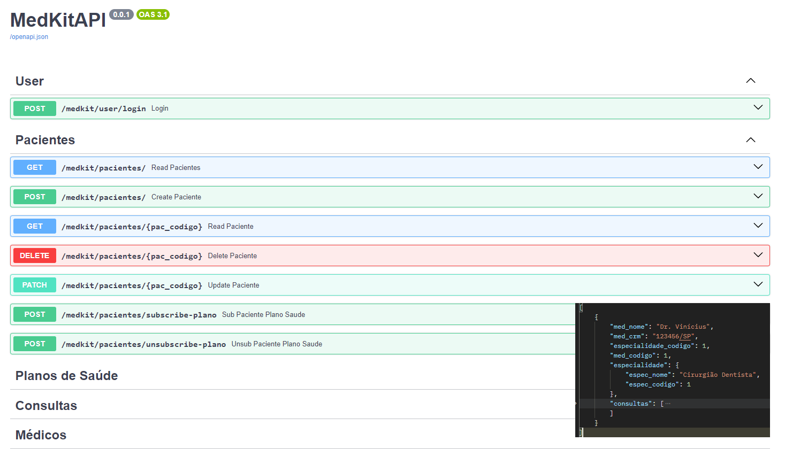

## Sobre
Prova de Python: Criar CRUD para gestão de uma clínica.

## Por que FASTAPI em vez de DJANGO?
**Django** nos daria a possibilidade de criar um **CRUD** pré pronto para modelos já definidos, mas decide fazer na "unha" para mostrar melhor o código.

## Melhorias
Eu tinha apenas o **Modelo Conceitual**, sem o modelo lógico ou qualquer regra de negócios definidas. Então decidi algumas das coisas, como por exemplo, a tipagem das colunas.
Por falta de tempo, não criei um **Repository** ou algum pattern do tipo, isso evitaria repetições desnecessárias de código, como por exemplo:
```
consulta_query = await session.execute(select(ConsultaModel).where(ConsultaModel.cons_codigo == cons_codigo))
consulta = consulta_query.scalars().first()

if not consulta:
    raise HTTPException(status_code=status.HTTP_404_NOT_FOUND, detail="Consulta não encontrada")
```

## Como rodar o projeto
Crie seu ambiente virtual:
```
python -m venv venv
```
Instale as dependências
```
pip -r requirements.txt
```
Crie o ``.env`` e o configure com o banco de dados e etc..:
```
cp .env-example .env
```
Rode as migrations do banco de dados(Isso já popula o DB com alguns dados de exemplo):
```
alembic upgrade head
```
Depois:
```
python main.py
```

### Verificar erros de lint:
```
flake8 --max-line-length=119 .
```

Acesse a doc do swagger em http://localhost:777/docs

Ou baixe o json exportado do POSTMAN:
https://raw.githubusercontent.com/pauloabreu/prova-medkit/postman.json
